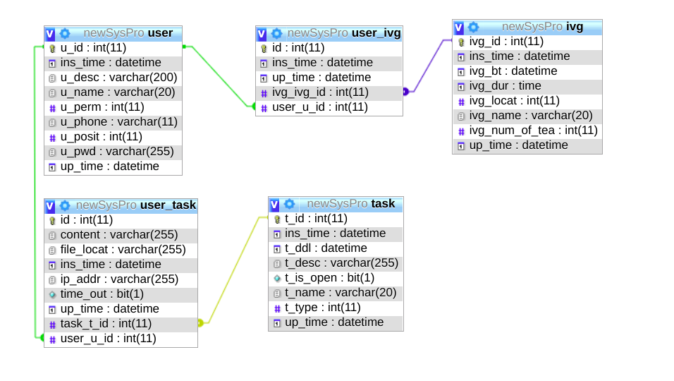

# 系统程序设计课程设计后端
## 技术栈
> SpringBoot2.0 \+ MySql 5.6 \+ Lombok等  

## E-R图
  
## 项目记录
2019.4.10  
后端环境搭建完成，数据库创建完成  
使用BCryptPasswordEncoder对密码进行多次加密，使得明文相同密文不同   
使用Encryptors基于秘钥和盐值对用户id和操作权限进行加密得到token  
完成用户部分的拦截器，对未携带Token的访问进行拦截  
基于原生的HttpStatus状态码进行错误返回，减少资源使用  
对于非受检异常进行统一异常处理
2019.4.14  
完成管理员的接口编写
